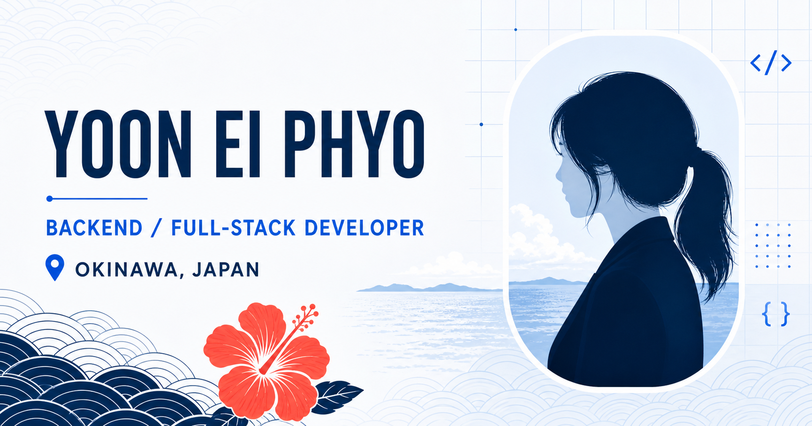

# 👩‍💻 Yoon Ei Phyo Portfolio

沖縄でWebプログラミングを学んでいる、Yoon Ei Phyoのポートフォリオサイトです。

自己紹介、スキル、制作したプロジェクト、資格、将来の目標などを1つのサイトにまとめています。

バックエンドエンジニア・フルスタックエンジニアを目指し、Next.js、React、TypeScriptを使用して制作しました。



---

## 🔗 公開サイト

[Portfolio Website](https://my-page-tau-five.vercel.app/)

---

## 📌 概要

このポートフォリオでは、私のプロフィールや今まで制作したWebアプリケーションを紹介しています。

沖縄をイメージしたデザインを取り入れ、パソコン・タブレット・スマートフォンで見やすいレスポンシブサイトを目指しました。

---

## ✨ 実装機能

### ナビゲーション

- 各セクションへのスムーズスクロール
- スクロール位置に合わせたメニュー表示の変更
- スマートフォン用ハンバーガーメニュー

---

### プロフィール

- 自己紹介
- 学校・コース情報
- 現在の居住地
- 将来の目標
- 自分の強み

---

### スキル一覧

現在学習しているプログラミング言語やツールをカード形式で表示しています。

- Java
- SQL / MySQL
- HTML / CSS
- JavaScript / TypeScript
- React / Next.js
- PHP
- Git / GitHub
- Vercel
- Spring Boot

---

### プロジェクト紹介

プロジェクトの画像や名前をクリックすると、公開サイトまたはGitHubリポジトリへ移動できます。

| プロジェクト | 内容 | リンク |
| --- | --- | --- |
| Dreaming | レスポンシブECサイト | [Live Demo](https://dreaming-portfolio.vercel.app/) |
| Java Banking System | Javaコンソール銀行システム | [GitHub](https://github.com/w25019/Bank) |
| Mood City | 気分によって街が変化するWebアプリ | [Live Demo](https://mood-city.vercel.app/) |
| TT Online Konbini | 日本語対応オンラインコンビニ | [Live Demo](https://tt-konbini.vercel.app/) |

---

### 資格・学習目標

- JLPT N2
- Java SE Bronze
- CompTIA Tech+
- Spring BootによるREST API開発を学習中

---

### レスポンシブデザイン

以下の画面サイズに対応しています。

- パソコン
- タブレット
- スマートフォン

---

## 🛠 使用技術

### Frontend

- Next.js
- React
- TypeScript
- CSS
- Lucide React

### 開発・公開環境

- VS Code
- Git
- GitHub
- Vercel

---

## 📂 ディレクトリ構成

```text
Portfollio
├── app
│   ├── globals.css          # サイト全体のデザイン
│   ├── layout.tsx           # 共通レイアウトとメタデータ
│   └── page.tsx             # ポートフォリオのメインページ
│
├── public
│   ├── projects
│   │   ├── dreaming.png
│   │   ├── java-bank.png
│   │   ├── mood-city.png
│   │   └── tt-konbini.png
│   ├── favicon.svg
│   ├── og.png
│   └── yoon-ei-phyo.jpeg
│
├── next.config.ts
├── package.json
└── README.md
```

---

## 🚀 ローカルで実行する方法

Node.js 22.13.0以上が必要です。

```bash
# パッケージをインストール
npm install

# 開発サーバーを起動
npm run dev
```

ブラウザで [http://localhost:3000](http://localhost:3000) を開きます。

本番用ビルドを確認する場合：

```bash
npm run build
```

---

## 💡 工夫した点

- 自分らしさを出すために沖縄をイメージした色やデザインを使用
- 実際のプロジェクト画像を使い、制作内容を分かりやすく表示
- ReactのStateを使ったモバイルメニューの開閉
- スクロール位置に合わせたナビゲーションの変更
- Intersection Observerを使ったスクロールアニメーション
- パソコンとスマートフォンの両方で見やすいレイアウト
- コードをセクションごとに分け、簡単なコメントを追加

---

## 🚀 今後の改善予定

- 履歴書・CVのダウンロード機能
- LinkedInリンクの追加
- プロジェクトの追加
- Next.js Imageを使った画像表示の最適化
- お問い合わせフォームの追加
- アクセシビリティと表示速度の改善

---

## 👩‍💻 開発者

**YOON EI PHYO**

専門学校沖縄ビジネス外語学院<br>
Webプログラミングコース

将来はバックエンドエンジニア・フルスタックエンジニアとして活躍することを目指しています。

- Email: [w25019@osfl.ac.jp](mailto:w25019@osfl.ac.jp)
- GitHub: [github.com/w25019](https://github.com/w25019)
